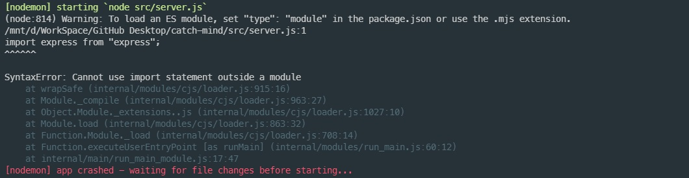
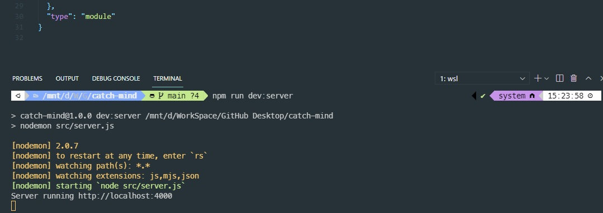
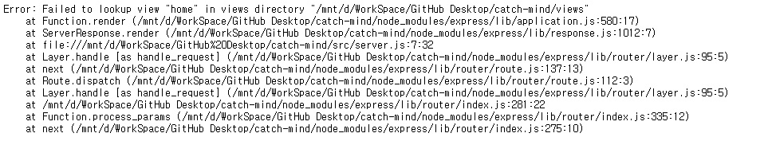
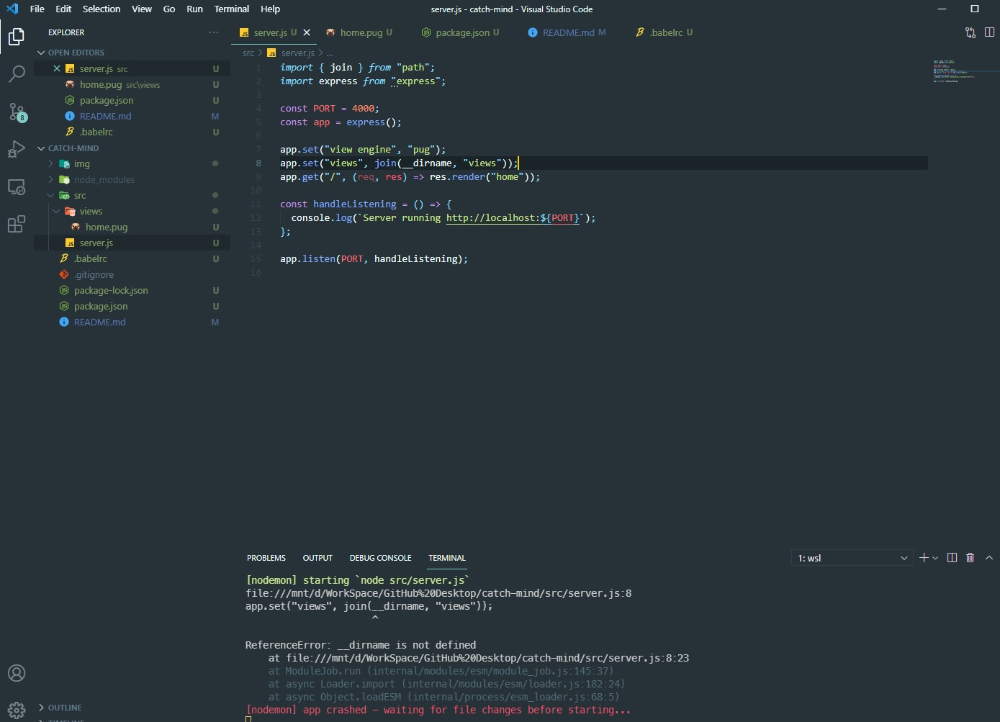

# catch-mind

Node로 만든 실시간 캐치마인드 게임

## 1.0 사용기술

> express  
> bable  
> Node  
> socket.io  
> pug

 

## 2.0 에러

### 2.1 Cannot use import statement outside a module 에러

> npm run dev:server를 이용해 서버를 작동 시키자 발생한 에러  
>   
> 해결방법/[링크](https://takeknowledge.netlify.app/bugfix/cannot-use-import-statement-outside-a-module/) : package.json파일에 "type": "module" 작성해주기  
> 

### 2.2 Failed to lookup view "home" in views directory 에러

> pug를 설치하고 home.pug를 불러오자 발생한 에러  
>   
> 해결방법 : 디렉터리 위치 파악을 못하기에 path를 import하여 join()을 이용해 디렉터리의 이름을 설정해 주었다.
>
>   
> 하지만 다시 에러가 발생 **dirname이 정의 되지 않았기에 에러가 발생  
> 해결방법/[링크](https://codenbike.tistory.com/221): ES6에서는 바로 쓰지않고 변수처리해서 사용하기에 발생하는 에러였기에  
> const **dirname = path.resolve(); 변수처리하여 문제해결  
> 하지만 다시 Failed to lookup view "home" in views directory 에러가 발생해서
> app.set("views", path.join(**dirname, "views")); 코드를  
> app.set("views", path.join(**dirname, "./src/views"));로 경로를 설정해주니 제대로 동작하게 되었음

### 2.3 ESLint module 에러

> 2.1번 에러 해결을 위해 "type": "module" 작성을 한 것이 ESLint가 실행되지 않는 에러를 발생하게 했다.  
> "type": "module"을 지우면 2.1번 에러가 발생해서 babel이 작동하지 않는 것 같아 알아보니  
> npm run dev:server 할 때 "dev:server": "nodemon --exec babel-node src/server.js"  
> babel-node를 넣어주니 잘 변환해서 서버가 작동되고 ESLint도 작동된다.
