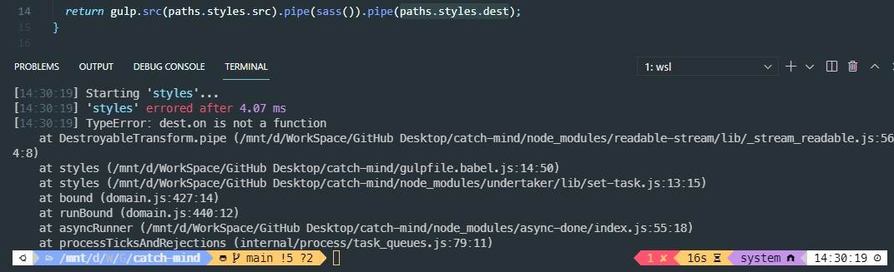
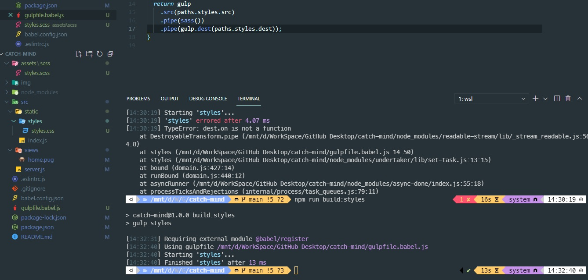

# catch-mind

Node로 만든 실시간 캐치마인드 게임

## 1.0 사용기술

> express v4.17.1  
> bable v7.14.2  
> Node  
> socket.io v4.1.1  
> pug v3.0.2  
> ESLint v7.26.0  
> Gulp v4.0.2

 

## 2.0 참고

### 2.1 Web Socket와 http의 차이

> 1. http는 post/get 방식과 같은 Stateless 방식이고 Server와 연결 후에 request에 응답하면 연결이 끊기기 떄문에
> 2. 사용자를 기억하기 위해선 쿠키가 필요하다.
> 3. WS는 사용자가 접속하면 연결을 끊지 않기에 Real Time이 가능하며 사용자가 많아지는 문제를 위해 메모리가 많이 필요하다.

### 2.2 Glup 사용 이유[Gulp npm](https://www.npmjs.com/package/gulp)

> 1. gulp 는 node.js 기반의 task runner 이다. 반복적인 귀찮은 작업들이나 프론트엔드 빌드에 필요한 작업들을 gulp 통해 쉽게 처리해줄 수 있다.
> 2. 프론트앤드 부분의 JS는 import나 export사용이 불가하기에 build를 이용해 사용 할 수 있도록 해야한다.
> 3. 모든 브라우저가 css 내용을 알 수 있게 [gulp-autoprefixer](https://www.npmjs.com/package/gulp-autoprefixer)를 설치했다.
> 4. gulpfile.babel.js 라고 파일 이름을 만든 이유는 babel이 붙으면 gulp가 자동으로 babelrc 파일을 찾아서, babel 설정대로 이 파일을 코딩할 수 있게 도와준다.

 

## 3.0 에러

### 3.1 Cannot use import statement outside a module 에러

> npm run dev:server를 이용해 서버를 작동 시키자 발생한 에러  
>   
> 해결방법/[링크](https://takeknowledge.netlify.app/bugfix/cannot-use-import-statement-outside-a-module/) : package.json파일에 "type": "module" 작성해주기  
> 

### 3.2 Failed to lookup view "home" in views directory 에러

> pug를 설치하고 home.pug를 불러오자 발생한 에러  
>   
> 해결방법 : 디렉터리 위치 파악을 못하기에 path를 import하여 join()을 이용해 디렉터리의 이름을 설정해 주었다.
>
>   
> 하지만 다시 에러가 발생 **dirname이 정의 되지 않았기에 에러가 발생  
> 해결방법/[링크](https://codenbike.tistory.com/221): ES6에서는 바로 쓰지않고 변수처리해서 사용하기에 발생하는 에러였기에  
> const **dirname = path.resolve(); 변수처리하여 문제해결  
> 하지만 다시 Failed to lookup view "home" in views directory 에러가 발생해서
> app.set("views", path.join(**dirname, "views")); 코드를  
> app.set("views", path.join(**dirname, "./src/views"));로 경로를 설정해주니 제대로 동작하게 되었음

### 3.3 ESLint module 에러

> 3.1번 에러 해결을 위해 "type": "module" 작성을 한 것이 ESLint가 실행되지 않는 에러를 발생하게 했다.  
> "type": "module"을 지우면 3.1번 에러가 발생해서 babel이 작동하지 않는 것 같아 알아보니  
> npm run dev:server 할 때 "dev:server": "nodemon --exec babel-node src/server.js"  
> babel-node를 넣어주니 잘 변환해서 서버가 작동되고 ESLint도 작동된다.

### 3.4 TypeError: dest.on is not a function 에러

> gulp를 이용해 style.css를 빌드하자 발생한 오류  
>   
> 마지막 pipe 함수안에 목적지는 gulp.dest()로 감싸줘야 한다.  
>   
> 왼쪽 src/static/ 안에 styles/styles.css 가 생성되었다.
